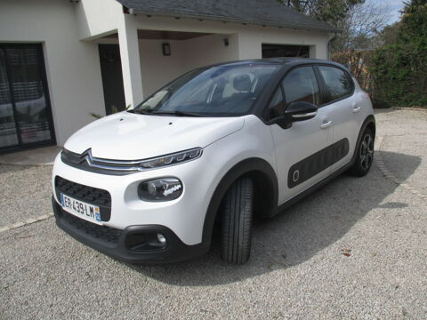

# Car model identification

## Overview
This project's goal is to create Proof of Concept for a model that can differentiate different car models. This project includes object detection, preprocessing techniques like grayscale, normalization and KMeans, as well as computer vision models such as Convolutional Neural Network (CNN) or Support Vector Machine (SVM)(Still in developement).

## Installation

```bash
git clone https://github.com/Scarler04/albert_project_PoC_G3
cd albert_project_PoC_G3
pip install -r requirements.txt
python .\scripts\CNN.py
python .\scripts\main.py
```
(This code will create a local file with the scraped data in the cloned repository)

## Script Files
[main.py](scripts/main.py) : Main program which regroups the whole optimized process (processes and models that were used in tests but weren't performant enough are not present in main.py)

[scraping.py](scripts/scraping.py) : Regroups the functions used in the scraping of ParuVendu

[preprocessing.py](scripts/preprocessing.py) : Regroups the functions used in the different preprocessing steps. Preprocessing methods here are for optimizing the computing time. Not all are used in the final version of main.py.

[CNN.py](scripts/CNN.py) : Trains the CNN model

## Dataset
The dataset is a set of photos of different resolutions scraped on [ParuVendu](https://www.paruvendu.fr/), a well known french used car sales site. You can find the photos on this google drive :

https://drive.google.com/drive/folders/13sQpVtFgQOGI02P-FGD4rb7x7tvAaKF8?usp=sharing

Here is an example of a photo :



## Going Deeper

### Data Preprocessing

In this dataset, every image has different resolution and sometimes even include elements other than the photo. These 2 next steps describe the data cleaning process :
- Object Identification : Finding the main car in the photo, to keep only the interesting part of the original photo that will be analyzed
- Redimensionning : Changing the shape of all images to suit the computer vision models (this step can take place after other preprocessing methods if they are to change the shape)

While treating a large dataset like this one, the training of models takes a lot of time (even while working with only 15 models), thus another goal was to reduce the computing time with different methods :
- Grayscale : The original image being in RGB code, it replaces 3 values by only one value ranging from 1 to 255, reducing the number of values the model has to treat.
- KMeans : Reducing the number of features also reduces the number of parameters in the computer vision models.
- Normalizing : Can help the optimization algorithm converge faster during training and also allows for more effective tuning of the learning rate hyperparameter. (+reduces overfitting)

Those methods will be compared when applied to the computer vision models CNN and SVM. The most performant preprocessing process will be kept.
